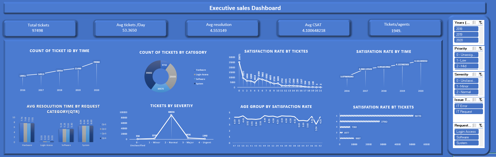

## 📊 Dashboard Preview

# IT Ticket Analysis using Excel

## 📌 Project Overview
This project analyzes IT support ticket data to evaluate service performance, resolution efficiency, and customer satisfaction. The analysis is performed using Microsoft Excel to identify trends, bottlenecks, and improvement opportunities in IT service operations.

---

## 🎯 Objectives
- Analyze ticket volume across categories and priorities  
- Evaluate average resolution time and service efficiency  
- Assess customer satisfaction levels  
- Identify performance gaps and improvement areas  

---

## 🛠 Tools & Technologies
- Microsoft Excel  
  - Pivot Tables  
  - Pivot Charts  
  - Excel Formulas  
  - Conditional Formatting  
  - Dashboards  
- PowerPoint (for presentation)  
- Microsoft Word (for documentation)

---

## 📂 Files Included
- **Excel file 26 nov.xlsm** – Main analysis file and dashboards  
- **PPT 26 nov.pptx** – Project presentation summarizing insights  
- **Report 26 nov.docx** – Detailed analysis report  

> ⚠️ Note: The Excel file is macro-enabled (.xlsm). Please enable macros to view full functionality.

---

## 📊 Key Analysis Performed
- Ticket volume analysis by category and priority  
- Average resolution time trends  
- Customer satisfaction analysis  
- Agent and issue-type performance comparison  

---

## 🔍 Key Insights
- Certain ticket categories consistently show higher resolution times  
- Satisfaction levels vary across issue types and priorities  
- Data highlights areas requiring process optimization  

---

## 📈 Outcome & Learnings
- Hands-on experience with Excel-based dashboards  
- Improved understanding of IT service performance metrics  
- Strengthened analytical and reporting skills  

---

## 🚀 Future Enhancements
- Automate data refresh  
- Add SLA breach analysis  
- Extend analysis using Power BI  

---

## 👤 Author
**Hritik Kumar**  
Aspiring Data / Business Analyst

